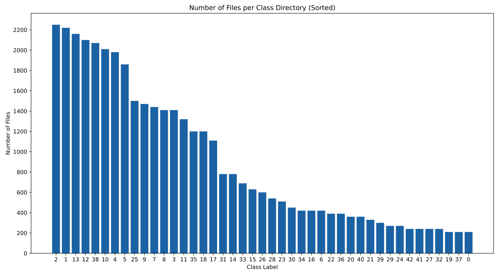
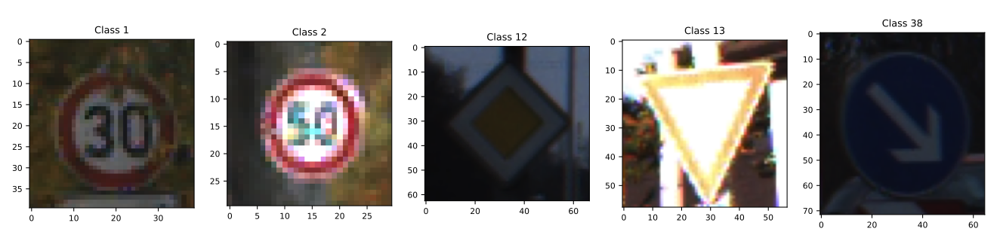
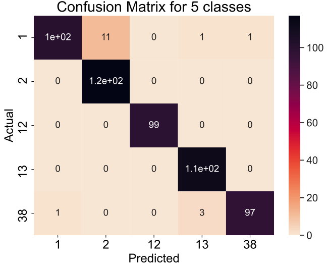

# German Traffic Signs Prediction using AWS Sagemaker

## Summary

This is the final project for AICamp's Full Stack Deep Learning using Amazon Sagemaker (Cohort #8) that ran from September 15th to October 8th, 2020. The course content was divided into two parts. The first focused on image classification and the second on time series forecasting. In both instances, once a model is trained, it is then deployed on AWS for inference purposes.

Here I have chosen an image classification project to predict German Traffic Signs. The dataset can be found [here](https://www.kaggle.com/meowmeowmeowmeowmeow/gtsrb-german-traffic-sign). There are a total 43 classes of traffic signs ranging from speed limit to warning signs.

The motivation is rooted in the application of self-driving cars where internal cameras have to immediately detect and classify traffic signs in various conditions, i.e. daylight, night time, partially visible, low image quality, etc for the safety of passengers and pedestrians.

The chosen deep learning model on AWS Sagemaker is 'Image Classification' or more popularly known as ResNet.

To that end, this notebook contains predictions first for 5 selected types of traffic signs and finally making a prediction for all 43 classes.

One of the most important take-aways for this project is the importance of shuffling the data in the lst file that is ingested by AWS Sagemaker for training and validation. Because if this is not done, the training accuracy is near perfect above 99% at least for this dataset but can dip below 40% for the validation and testing. Hence, this has to be kept in mind at all times.

## Results (Distilled)

As mentioned, the dataset itself contains 43 types of traffic signs that are common in the German roadways. Figure 1 below shows the number of images distributed among each class. 

<figure>
	
</figure>

<b>Figure 1</b>: Distribution of Traffic Signs for all Classes 

As can be seen, the dataset itself is imbalanced. To start, I chose the first 5 classes in terms of the number of observations (images) which are classes 1, 2, 12, 13 and 38, respectively as a first test. These classes are nearly balanced with over 2,000 images each. Figure 2 below shows the traffic signs that are being classified.

<figure>
	
</figure>

<b>Figure 2</b>: The 5 classes of German Traffic Signs

 

After training and validating the 5 class dataset, an accuracy of over 99% was achieved! Figure 3 below shows the confusion matrix for the 5-class prediction.

<figure>
	
</figure>

<b>Figure 3</b>: Confusion Matrix for 5 Class Prediction

 

From Figure 3, an accuracy of **96.9%** is achieved. It looks like the model is having some slight trouble predicting Class 2 which in the true dataset (50 kph) speed sign. This is slightly odd. Since Class 1 and Class 2 are speed limit signs, it is somewhat confusing the two but not by a large margin. Perhaps it is slightly misclassifying the '3' and '5' in the speed limit image.

The same procedure was followed for predicting all 43-classes and the end result was an accuracy of **95.7%**. One can take a look at the Jupyter notebook attached in this repository to view the confusion matrix. There is still some confusion in the predicting Classes 1 and 2.

## Closing Remarks

Again, for 43 classes we are seeing an accuracy of 95.7% which is still fantastic! Note that the dataset is severely imbalanced but yet is still able to reach an accuracy that is really high.

From the confusion matrix above, it is clear that the classifier has a little trouble with the speed limit signs where it confuses Class 1 and Class 2, i.e. 30 and 50 kph. This could potentially be due to the image quality. I noticed that some of the speed signs are really dark and hard to make out.

A classifier will have problems with this. Thinking of this holistically, if a self-driving car is unable to determine the speed limit in a residential neighborhood, this can be really dangerous. If the speed limit is 30 kph but mis-classifies it as 50 kph, a speed ticket could be issued. Furthermore, if there are pedestrians, will the vehicle be able to stop in time to avoid an accident?

Perhaps care needs to be taken when training image recognition especially for self-driving cars. The next steps could be:

1. Train ResNet from scratch on the entire dataset

2. Have more image data distinguishing Class 1 and Class 2 more clearly OR look closely as to which images were misclassified especially for Class 2. In this case, the prediction function will need to be slightly modified to dump out the real-time predictions to either a csv or json file. From there it can be further analyzed.

3. Discard bad images beforehand. Note that some traffic signs were vandalized and that made the numbers on the sign not visible.

**The biggest take-home message from this project is that the training and validation dataset need to be shuffled properly beforehand. This has improved the accuracy tremendously!**